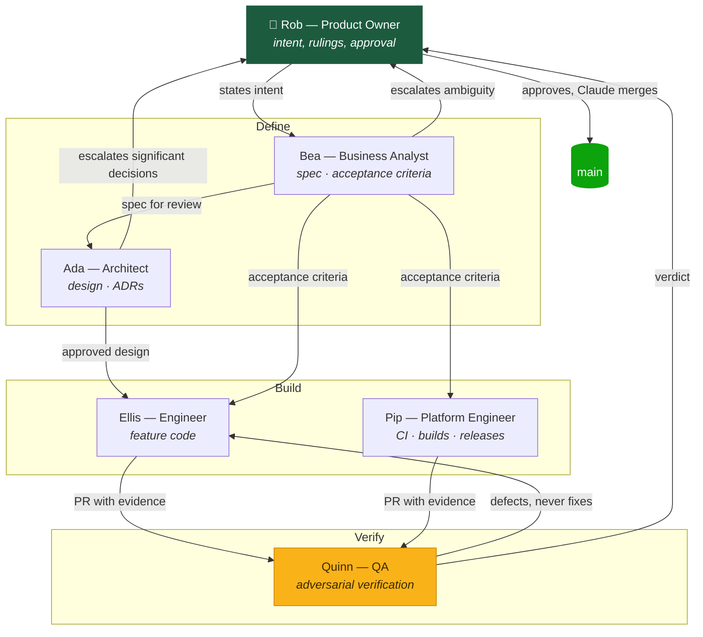
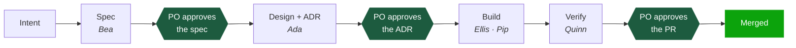
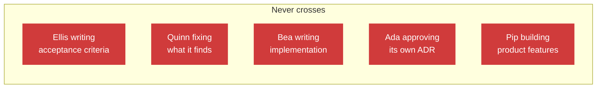

# The squad, visualised

Five roles, each a separate agent with its own charter, context and boundaries.
This page is the map; each charter is the detail.

## Why they have names

The agents are named — Bea, Ada, Ellis, Quinn, Pip — for three reasons.

**It makes the handoffs legible.** "Bea escalated it, Ada ruled, Ellis
implemented, Quinn found the gap" reads as a chain of custody. "The BA escalated
it to the Architect" reads as process documentation.

**It makes the history queryable.** Every commit carries a `Squad-Role` trailer
naming the agent that produced it, so `git log --grep="Squad-Role: Quinn"` shows
every change that came out of verification. Today one account authors everything
(see [#38](https://github.com/vanstoner/coaching-app/issues/38) on why that is a
weakness), so the trailer is the only available attribution.

**First names only**, deliberately. The same rule the app applies to the children
whose minutes it tracks (`CLAUDE.md` invariant 4). If it is good enough for the
players, it is good enough for the squad.

Names are labels, not personas. An agent is its charter; the name is how the
charter shows up in a commit log.

## The squad

| Name | Role | Owns | Never does |
|---|---|---|---|
| **Bea** | [Business Analyst](./business-analyst.md) | Specs, issues, acceptance criteria | Write implementation code |
| **Ada** | [Architect](./architect.md) | Technical design, ADRs, domain integrity | Write feature code |
| **Ellis** | [Engineer](./engineer.md) | Feature implementation | Write its own acceptance criteria |
| **Quinn** | [QA](./qa.md) | Adversarial verification | Fix what it finds |
| **Pip** | [Platform Engineer](./platform-engineer.md) | CI/CD, builds, releases, device infrastructure | Implement product features |

**Rob (Product Owner)** sits above all five: sets intent, approves specs and
ADRs, arbitrates trade-offs, and is the only one who can say "ship it".

## How work flows

## The gates

Three points where work stops until Rob rules. They are hard gates, not
checkpoints.

## The boundaries that matter

Separation is the whole point. A single agent asked to spec, build and test
produces code that passes its own tests, because it wrote both from one
interpretation. If that interpretation is wrong, nothing catches it.

Each one exists because of a specific failure it prevents:

| Boundary | The failure it prevents |
|---|---|
| Ellis never writes acceptance criteria | Code that passes because it defined its own pass mark |
| Quinn never fixes | A verifier invested in its own fix stops looking for the next fault |
| Bea never implements | A spec bent toward what is easy to build |
| Ada never approves its own ADR | A preference dressed as a decision |
| Pip never builds features | Build infrastructure quietly becoming the place product logic hides |

## Why Pip exists

Pip was added on 2026-09-17, after Ellis spent five CI runs and roughly fifty
minutes on Android build infrastructure: an NDK that failed to install, a
`yes | sdkmanager` pipeline dying of `SIGPIPE` under `pipefail`, and `aapt2`
changing its output format between build-tools versions.

Ellis handled all of it correctly. But none of it was feature work, and there is
a great deal more of it queued — emulator smoke tests
([#43](https://github.com/vanstoner/coaching-app/issues/43)), release signing,
keystore management, versioning, distribution. That is a discipline, not a
detour.

The seam with Quinn is deliberate: **Quinn says what proof is required, Pip
builds the mechanism that produces it, Quinn then checks the mechanism proves
what it claims.** Quinn never builds; Pip never decides what counts as verified.

## Running them

Sequentially rather than orchestrated, unless Rob asks otherwise — he wants
visibility into each handoff. Model selection per role is an open question
([#27](https://github.com/vanstoner/coaching-app/issues/27), OMP-003).

Agent definitions live in `.claude/agents/`. The charters in this directory are
the contract; the agent files are the wiring.
