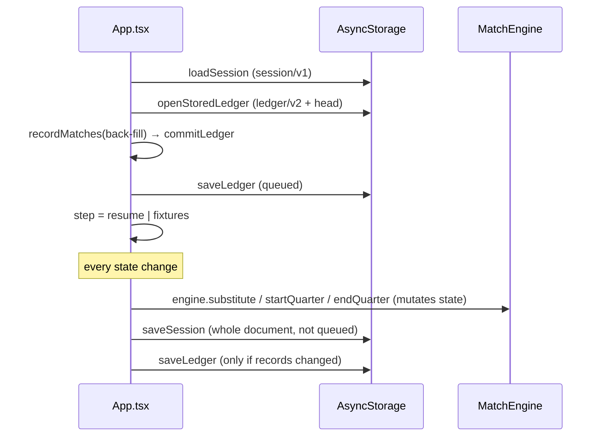
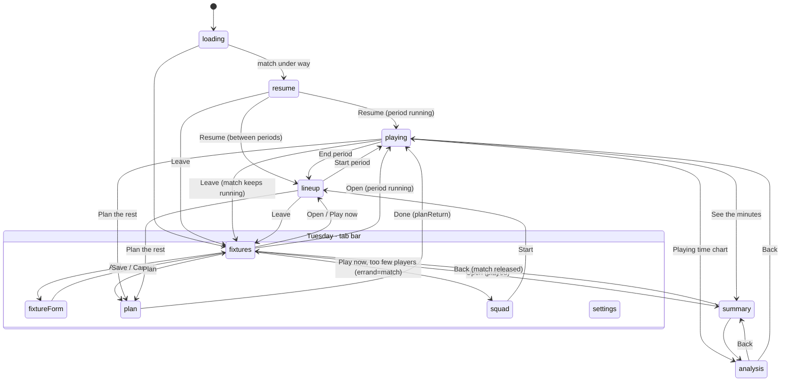

# System architecture

Status: **Draft**, retrofitted from the code at `e04fbb0` (v1.0.1), 2026-10-09.
Last updated: 2026-10-09

One page. Where it and the code disagree, the code wins. Fix this page.

## Stack

| | Version | Note |
|---|---|---|
| Expo (managed, `expo prebuild` in CI) | 57.0.23 | No `android/` or `ios/` checked in |
| React Native | 0.86.3 | New Architecture, Hermes, edge-to-edge mandatory on Android |
| React | 19.2.3 | |
| TypeScript | 5.9 | `strict: true`; no `any` in `src/` outside tests |
| Storage | `@react-native-async-storage/async-storage` 3.1.1 | Behind `KeyValueStore` |
| Safe areas | `react-native-safe-area-context` ~5.7.0 | The shell pads once; bottom sheets add the bottom inset (#174) |
| Other native modules | `expo-file-system`, `expo-sharing`, `expo-font`, `react-native-view-shot` | Ledger export/import, Share plan image |

No navigation library, no state library, no network client. See [ADR-001](./decisions/001-react-native-expo.md), [ADR-018](./decisions/018-session-and-ledger-in-asyncstorage.md) and [ADR-019](./decisions/019-shell-owns-state-step-machine-routes.md).

## Layout

```
index.ts            registerRootComponent(App)
App.tsx             the shell: all app state, every action, the router (1,378 lines)
src/engine/         MatchEngine — pure TS, mutates a MatchState in place
src/types/          domain types, uuid() (Hermes-safe)
src/app/            pure rules, each with a *.test.ts beside it; storage adapters
src/screens/        React components; take props, hold only view state
.github/            CI, APK/IPA builds, releases, store listing
```

Rule: `src/engine` and `src/app` import no React and no platform module, with
four exceptions in `src/app`: `storage.ts` (AsyncStorage), `ledgerFile.ts`,
`planImageFile.ts` (file system, sharing) and `fonts.ts`.

## State lifecycle



- **All durable state lives in `App.tsx`** `useState`s. Screens receive values
  and callbacks.
- **The live match** is `{ engine, state, format }`. The engine mutates
  `state` in place; the shell then calls `persist()` (and `repaint()` where no
  other state changes).
- **Time** is never counted. `getQuarterElapsedMs` = `accumulatedMs + now −
  runningSinceWallClock`. `ClockScreen` reschedules a `setTimeout` to the next
  displayed second, only to repaint. `appNow()` (`src/app/appClock.ts`) is the
  single clock, sped up by the Test kit in beta builds.
- **Saves are fire-and-forget.** A failed write keeps the match running in
  memory. The ledger's writes run one at a time per store; the session's do not.

## Storage

| Key | Contents | Writer | Versioning |
|---|---|---|---|
| `coaching-app/session/v1` | `SavedSession`: squad, defaults, every match (planned, live, played), plans | `saveSession` | `schemaVersion` 6, `MIGRATIONS` in `persistence.ts`, unknown fields kept |
| `coaching-app/ledger/v2` | Minutes ledger: hash-chained entries (ADR-013, ADR-014) | `saveLedger` (serialised queue) | own format version; too-new → read-only |
| `coaching-app/ledger/head` | Last chain head, guards rollback | `saveLedger` | |
| `coaching-app/ledger/v1` | Pre-v2 ledger, read for upgrade only | none | |
| `coaching-app/ledger/v2/unreadable/<iso>` | A ledger that failed to verify, set aside intact | `openStoredLedger` | |
| `TEST_CLOCK_KEY` | Beta clock offset and speed | Test kit only | |

Nothing leaves the device except a ledger file or plan image the coach shares
explicitly (ADR-011). Android `allowBackup` is **true** for Heart FC Coach and
false for the beta (#112).

## Navigation topology

A `Step` (`src/app/tabs.ts`) picks one screen. No navigator, no back stack.



Every Saturday screen (lineup, playing, summary, analysis, plan from a match)
is full screen with an explicit exit; the match keeps running when left.

`effectiveStep` collapses any Saturday step without a held match to
`fixtures`. The Android hardware back button is not handled: it backgrounds
the app from every screen (#175).

## Builds

`APP_VARIANT=beta` (pull requests) gives Heart FC Beta Coach its own app id,
icon and empty storage. `main` builds Heart FC Coach. Version from `app.json`,
build numbers from CI run numbers (`app.config.js`).
